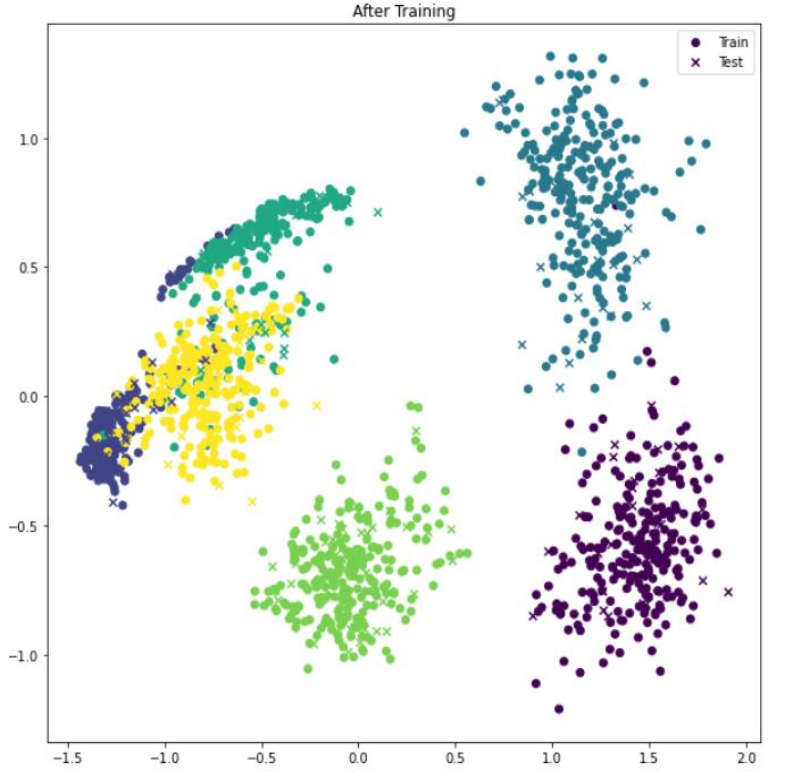
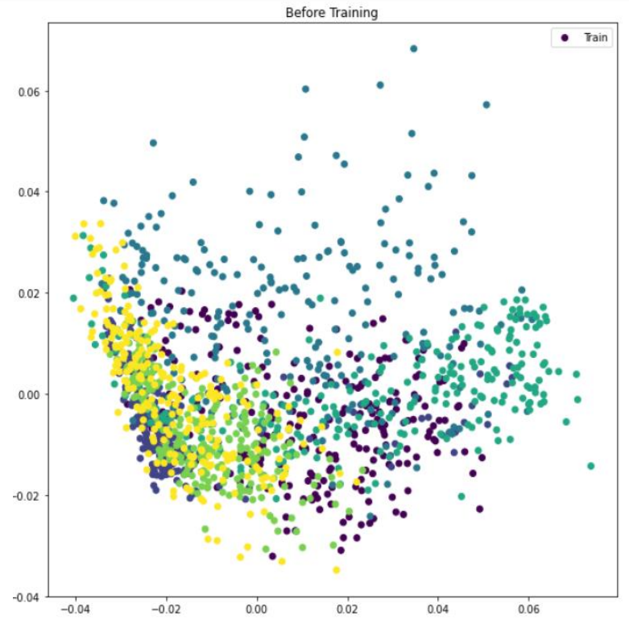

# Fine-Grained Classification Using Deep Metric Learning

## Overview
This project builds an efficient model for classifying anomalies in mechanical components using **Deep Metric Learning**. It is particularly useful for tasks where classes exhibit high intra-variance and low inter-variance, making traditional classification methods less effective.

## Features
- **Triplet Loss Function**: Optimizes distance measurements to improve classification accuracy.
- **Embedding Model**: Maps input data into a feature space where learned distance metrics can differentiate between categories.
- **Improved Accuracy**: Outperforms traditional classification methods, especially for complex data distributions.

## Triplet Loss Function
The Triplet Loss function ensures that the distance between the anchor sample \(A\) and positive sample \(P\) is smaller than the distance between the anchor and the negative sample \(N\), ensuring better separation between classes.

\[
L(A, P, N) = \max\left(0, \| f(A) - f(P) \|^2 - \| f(A) - f(N) \|^2 + \alpha \right)
\]

Where:
- \(A\): **Anchor** sample
- \(P\): **Positive** sample (same class as Anchor)
- \(N\): **Negative** sample (different class from Anchor)
- \(f(\cdot)\): Embedding function
- \( \alpha \): Margin to ensure separation

## Embedding Visualization

### Before Training:
The embeddings are scattered, with no clear separation between classes.

### After Training (Using Triplet Loss):
The embeddings form well-defined clusters, with similar classes grouped together and distinct classes separated.




## Installation
1. Clone the repository:
   ```bash
   git clone https://github.com/your-username/repo-name.git
   cd repo-name
