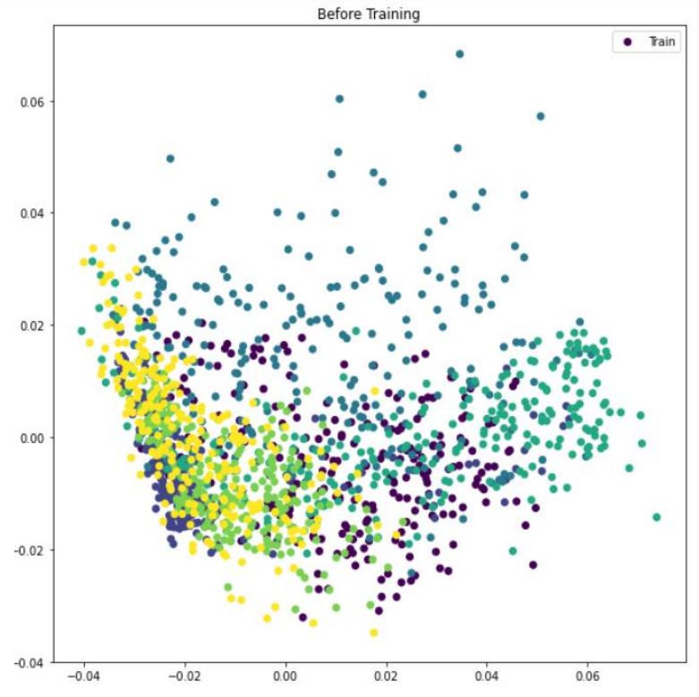
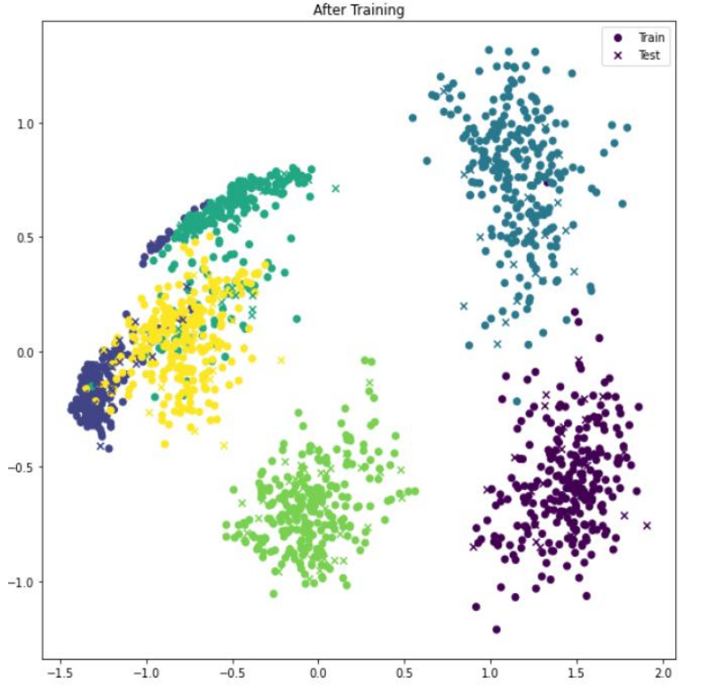

````markdown
# Fine-Grained Classification Using Deep Metric Learning

## Overview

This project implements a **Deep Metric Learning** pipeline for fine-grained classification of mechanical component anomalies. Instead of directly predicting class labels, the model learns a discriminative embedding space where visually similar samples are located close together while different classes are pushed farther apart.

This approach is particularly effective for industrial inspection tasks where defects exhibit **high intra-class variation** and **low inter-class variation**, making conventional classification models less reliable.

---

## Key Features

- 🚀 Deep Metric Learning framework using **Triplet Loss**
- 📊 Learns robust feature embeddings instead of class probabilities
- 🎯 Improved separation between visually similar defect categories
- 🔍 Suitable for fine-grained industrial inspection and anomaly classification
- 📈 Embedding visualization before and after training

---

## Methodology

Instead of learning to directly classify an image, the network learns an **embedding function** that maps each image into a feature vector.

```text
f(x): x → ℝᵈ
```

where:

- **x** is the input image.
- **f(x)** is the learned embedding vector.
- **d** is the embedding dimension.

The objective is to create an embedding space where:

- Images belonging to the **same class** are located close together.
- Images belonging to **different classes** are pushed farther apart.

This embedding space can then be used for similarity search, clustering, or classification using distance metrics.

---

## Triplet Loss

Training is performed using **Triplet Loss**.

Each training sample consists of three images:

- **Anchor (A):** reference image.
- **Positive (P):** image belonging to the same class as the anchor.
- **Negative (N):** image belonging to a different class.

The Triplet Loss is defined as:

```text
L(A, P, N) =
max(
    0,
    ||f(A) − f(P)||²
    − ||f(A) − f(N)||²
    + α
)
```

where:

- **f(·)** is the embedding network.
- **α** is the margin that enforces a minimum separation between classes.

The objective is to:

- **Minimize** the distance between the anchor and the positive sample.
- **Maximize** the distance between the anchor and the negative sample.

This encourages the model to learn highly discriminative feature representations.

---

## Embedding Space Visualization

### Before Training

Before optimization, the embeddings are randomly distributed with poor class separability.



---

### After Training

After training with Triplet Loss, images from the same class naturally form compact clusters while different classes become well separated.



---

## Applications

This project is well suited for:

- Industrial quality inspection
- Mechanical defect classification
- Surface anomaly detection
- Image retrieval
- Visual similarity search
- Few-shot learning
- Product recognition

---

## Results

Deep Metric Learning produces a structured embedding space that significantly improves class separability compared to conventional classification approaches.

By learning feature similarities rather than class probabilities, the model becomes more robust for fine-grained recognition tasks where categories have subtle visual differences.

---

## Future Improvements

- Hard Triplet Mining
- Semi-Hard Triplet Mining
- Contrastive Learning
- ArcFace / CosFace losses
- FAISS-based nearest-neighbor search
- Real-time inference deployment

---

## License

This project is released under the MIT License.
````
